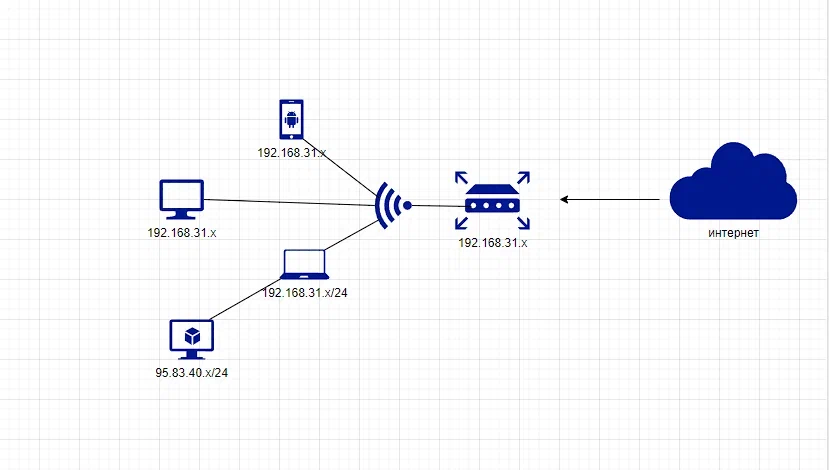

##                Домашнее задание по лекции "Компьютерные сети (лекция 3) <br/> <br/>

**1.** Подключитесь к публичному маршрутизатору в интернет. Найдите маршрут к вашему публичному IP <br/>

`route-views>show ip route 95.73.40.183/32` <br/>
                                      ^
`% Invalid input detected at '^' marker.` <br/>

```shell
route-views>show ip route 95.73.40.183
Routing entry for 95.73.40.0/21
  Known via "bgp 6447", distance 20, metric 0
  Tag 2497, type external
  Last update from 202.232.0.2 7w0d ago
  Routing Descriptor Blocks:
  * 202.232.0.2, from 202.232.0.2, 7w0d ago
      Route metric is 0, traffic share count is 1
      AS Hops 2
      Route tag 2497
      MPLS label: none
```
[show_ip_route](https://disk.yandex.ru/i/F_IYPyl4d-V-BQ) <br/>

**2.** Создайте `dummy0` интерфейс в Ubuntu. Добавьте несколько статических маршрутов. Проверьте таблицу маршрутизации. <br/>

- Создал `dummy0` интерфейс: <br/>

```shell
vagrant@vagrant:~$ sudo ip link add dummy0 type dummy
vagrant@vagrant:~$ ip -c -br link
lo               UNKNOWN        00:00:00:00:00:00 <LOOPBACK,UP,LOWER_UP>
eth0             UP             08:00:27:b1:28:5d <BROADCAST,MULTICAST,UP,LOWER_UP>
dummy0           DOWN           8e:e5:e1:6d:c8:49 <BROADCAST,NOARP>
```
<br/>

- Проверил таблицу маршрутизации: <br/>

```shell
vagrant@vagrant:~$ ip route show
default via 10.0.2.2 dev eth0 proto dhcp src 10.0.2.15 metric 100
10.0.2.0/24 dev eth0 proto kernel scope link src 10.0.2.15
10.0.2.2 dev eth0 proto dhcp scope link src 10.0.2.15 metric 100
```
<br/>

- Добавил статические маршруты: <br/>

```shell
vagrant@vagrant:~$ ip route show
default via 10.0.2.2 dev eth0 proto dhcp src 10.0.2.15 metric 100
10.0.2.0/24 dev eth0 proto kernel scope link src 10.0.2.15
10.0.2.2 dev eth0 proto dhcp scope link src 10.0.2.15 metric 100
95.73.40.183 dev eth0 scope link
192.168.23.0/24 via 10.0.2.15 dev eth0
````
<br/><br/>

**3.** Проверьте открытые TCP порты в Ubuntu, какие протоколы и приложения используют эти порты?<br/> Приведите несколько примеров. <br/>
```shell
vagrant@vagrant:~$ ss -tlp (t -tcp; l -listen (в ожидании входящего трафика); p - процесс)
State   Recv-Q  Send-Q     Local Address:Port       Peer Address:Port  Process
LISTEN  0       4096       127.0.0.53%lo:domain          0.0.0.0:*
LISTEN  0       128              0.0.0.0:ssh             0.0.0.0:*
LISTEN  0       128                 [::]:ssh                [::]:*

vagrant@vagrant:~$ ss -tlpn 
State    Recv-Q   Send-Q     Local Address:Port     Peer Address:Port  Process
LISTEN   0        4096       127.0.0.53%lo:53            0.0.0.0:*
LISTEN   0        128              0.0.0.0:22            0.0.0.0:*
LISTEN   0        128                 [::]:22               [::]:*


vagrant@vagrant:~$ ss -t -a (t - tcp; a - соединения ожидающие подключений)
State     Recv-Q     Send-Q         Local Address:Port           Peer Address:Port     Process
LISTEN    0          4096           127.0.0.53%lo:domain              0.0.0.0:*
LISTEN    0          128                  0.0.0.0:ssh                 0.0.0.0:*
ESTAB     0          0                  10.0.2.15:ssh                10.0.2.2:50153
LISTEN    0          128                     [::]:ssh                    [::]:*


vagrant@vagrant:~$ ss -lntup (tcp и udp соединения одновременно)
Netid    State     Recv-Q    Send-Q        Local Address:Port       Peer Address:Port   Process
udp      UNCONN    0         0             127.0.0.53%lo:53              0.0.0.0:*
udp      UNCONN    0         0            10.0.2.15%eth0:68              0.0.0.0:*
tcp      LISTEN    0         4096          127.0.0.53%lo:53              0.0.0.0:*
tcp      LISTEN    0         128                 0.0.0.0:22              0.0.0.0:*
tcp      LISTEN    0         128                    [::]:22                 [::]:*
```
<br/>

**4.** Проверьте используемые UDP сокеты в Ubuntu, какие протоколы и приложения используют эти порты? <br/>
```shell
 vagrant@vagrant:~$ ss -ulpn
State      Recv-Q     Send-Q          Local Address:Port         Peer Address:Port    Process
UNCONN     0          0               127.0.0.53%lo:53                0.0.0.0:*
UNCONN     0          0              10.0.2.15%eth0:68                0.0.0.0:*

53 - DNS-сервер (общий доступ к подключению интернета)
68 - Bootstrap Protocol Client (клиент протокола начальной загрузки)
```
<br/>

**5.** Используя diagrams.net, создайте L3 диаграмму вашей домашней сети или любой другой сети, с которой вы работали. <br/>



<br/>