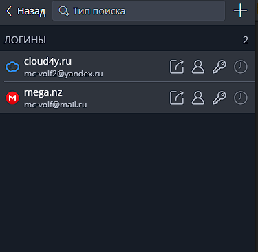

##         Домашнее задание к занятию "3.9. Элементы безопасности информационных систем" <br/> <br/>


**1.** Установите `Bitwarden` плагин для браузера. Зарегистрируйтесь и сохраните несколько паролей. <br/>



<br/>

**2.** Установите `Google authenticator` на мобильный телефон. <br/>  Настройте вход в `Bitwarden` аккаунт через `Google authenticator` OTP. <br/><br/>


<br/>

**3.** Установите `apache2`, сгенерируйте самоподписанный сертификат, настройте тестовый сайт для работы по HTTPS. <br/> <br/>


<br/>


<br/>

**4.** Проверьте на TLS уязвимости произвольный сайт в интернете (кроме сайтов МВД, ФСБ, МинОбр, НацБанк, РосКосмос, РосАтом, РосНАНО и любых госкомпаний, объектов КИИ, ВПК ... и тому подобное).<br/>

Как показано на презентации, скачал скрипт `testssl.sh` из репозитория `https://github.com/drwetter/testssl.sh.git` <br/>
Запустил быстрый тест: (на примере проверка сайта `mail.ru`) <br/>

```shell
vagrant@ubuntu2004:~/testssl.sh$ ./testssl.sh -e --fast --parallel https://mail.ru 
```

Так же, запустил сканирование утилитой `nmap`

```shell
Starting Nmap 7.80 ( https://nmap.org ) at 2022-07-10 22:49 UTC
Nmap scan report for mail.ru (217.69.139.200)
Host is up (0.0048s latency).
Other addresses for mail.ru (not scanned): 217.69.139.202 94.100.180.200 94.100.180.201 2a00:1148:db00:0:b0b0::1
Not shown: 998 filtered ports
PORT    STATE SERVICE    VERSION
80/tcp  open  http       nginx 1.14.1
443/tcp open  ssl/https?
Warning: OSScan results may be unreliable because we could not find at least 1 open and 1 closed port
Device type: general purpose|switch|phone|game console|VoIP adapter
Running (JUST GUESSING): Linux 1.0.X (88%), Cisco embedded (87%), Nokia Symbian OS (87%), Ouya embedded (86%)
OS CPE: cpe:/o:linux:linux_kernel:1.0.9 cpe:/h:cisco:catalyst_1900 cpe:/o:nokia:symbian_os cpe:/h:cisco:ata_188_voip_gateway
Aggressive OS guesses: Linux 1.0.9 (88%), Cisco Catalyst 1900 switch (87%), Nokia 3600i mobile phone (87%), OUYA game console (86%), Cisco ATA 188 VoIP adapter (85%)
No exact OS matches for host (test conditions non-ideal).
Network Distance: 2 hops

TRACEROUTE (using port 80/tcp)
HOP RTT     ADDRESS
1   0.27 ms _gateway (10.0.2.2)
2   0.36 ms mail.ru (217.69.139.200)

OS and Service detection performed. Please report any incorrect results at https://nmap.org/submit/ .
Nmap done: 1 IP address (1 host up) scanned in 106.70 seconds
```


<br/>


<br/>

**5.** Установите на Ubuntu ssh сервер, сгенерируйте новый приватный ключ. <br/> Скопируйте свой публичный ключ на другой сервер. <br/> Подключитесь к серверу по SSH-ключу. <br/>

- Установил openssh-server: <br/>
```shell
apt install openssh-server
```


- Сгенерировал ключ:
```shell
ssh-keygen -t rsa -b 4096 -f ~/.ssh/mykey -C "my@email.com"
Your identification has been saved in /home/devops/.ssh/mykey
Your public key has been saved in /home/devops/.ssh/mykey.pub
```

- Скопировал публичный ключ на удаленный сервер: <br/>
```shell
ssh-copy-id -i ~/.ssh/mykey devops2@192.168.247.138
```


- Подключился к удаленному серверу: <br/>
```shell
`ssh -i ~/.ssh/mykey devops2@192.168.247.138`
```


**6.** Переименуйте файлы ключей из задания 5. Настройте файл конфигурации SSH клиента, так чтобы вход на удаленный сервер осуществлялся по имени сервера. <br/>
```shell
sudo mv ~/.ssh/mykey ~/.ssh/mykey_vm2
sudo mv ~/.ssh/mykey.pub ~/.ssh/mykey.pub_vm2
sudo nano ~/.ssh/config

Host vm2
HostName 192.168.247.138
IdentityFile ~/.ssh/mykey_vm2
User devops2
Port 22

devops@vm1:~/.ssh$ ssh vm2
Welcome to Ubuntu 22.04 LTS (GNU/Linux 5.15.0-41-generic x86_64)
```


**7.** Соберите дамп трафика утилитой tcpdump в формате pcap, 100 пакетов. Откройте файл pcap в Wireshark. <br/>
```shell
root@mc-volf:~# sudo tcpdump -c 100 -w dump.pcap
tcpdump: listening on ens33, link-type EN10MB (Ethernet), snapshot length 262144 bytes
100 packets captured
100 packets received by filter
0 packets dropped by kernel
```

```shell
root@mc-volf:~# wireshark dump.pcap
```

```shell
root@mc-volf:~# tcpdump --list-interfaces
1.ens33 [Up, Running, Connected]
2.any (Pseudo-device that captures on all interfaces) [Up, Running]
3.lo [Up, Running, Loopback]
4.bluetooth0 (Bluetooth adapter number 0) [Wireless, Association status unknown]
5.bluetooth-monitor (Bluetooth Linux Monitor) [Wireless]
6.nflog (Linux netfilter log (NFLOG) interface) [none]
7.nfqueue (Linux netfilter queue (NFQUEUE) interface) [none]
8.dbus-system (D-Bus system bus) [none]
9.dbus-session (D-Bus session bus) [none]
```
**8**.* Просканируйте хост `scanme.nmap.org`. Какие сервисы запущены? <br/>
```shell
root@mc-volf:~# nmap -Pn -F -T5 scanme.nmap.org 
Starting Nmap 7.80 ( https://nmap.org ) at 2022-07-17 01:08 MSK
Nmap scan report for scanme.nmap.org (45.33.32.156)
Host is up (0.19s latency).
Other addresses for scanme.nmap.org (not scanned): 2600:3c01::f03c:91ff:fe18:bb2f
Not shown: 98 filtered ports
PORT   STATE SERVICE
22/tcp open  ssh
80/tcp open  http
```
Поднят `ssh-client default port 22`, `web-server default port 80` <br/>

**9**.* Установите и настройте фаервол `ufw` на web-сервер из задания 3. Откройте доступ снаружи только к портам 22,80,443 <br/>
```shell
root@mc-volf:~# sudo ufw status verbose
Status: active
Logging: on (low)
Default: deny (incoming), allow (outgoing), disabled (routed)
New profiles: skip

To                         Action      From
--                         ------      ----
80,443/tcp (WWW Full)      ALLOW IN    Anywhere                  
22/tcp                     ALLOW IN    Anywhere                  
80,443/tcp (WWW Full (v6)) ALLOW IN    Anywhere (v6)             
22/tcp (v6)                ALLOW IN    Anywhere (v6)

devops@vm1:~$ sudo ufw enable
Firewall is active and enabled on system startup
devops@vm1:~$ sudo ufw status verbose
Status: active
Logging: on(low)
Default: deny (incoming), allow (outgoing), disabled (routed)
New profiles: skip
```


<br/>

