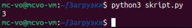
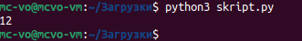
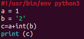
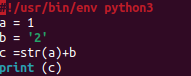
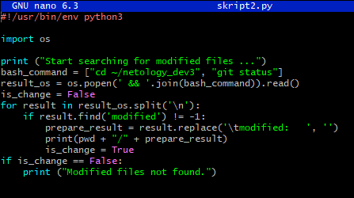
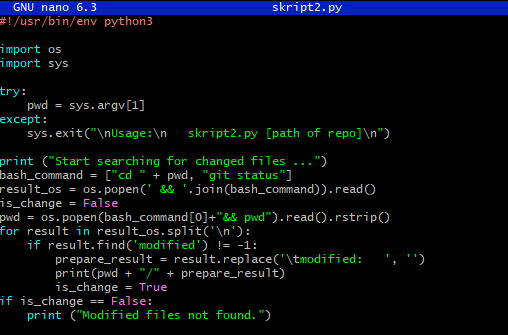
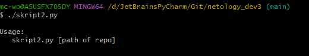
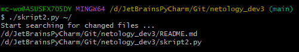
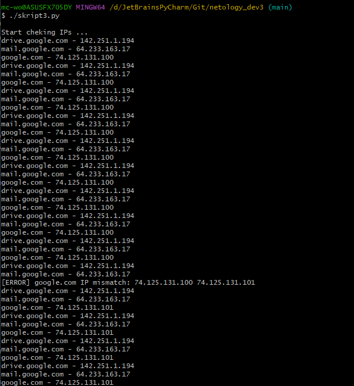

## Домашнее задание к занятию "4.2. Использование Python для решения типовых DevOps задач" <br/> <br/>


## Обязательная задача 1 <br/>

Есть скрипт: <br/>
```shell
#!/usr/bin/env python3
a = 1
b = '2'
c = a + b
```
### Вопросы: <br/>

|Вопросы|Ответы|
|-------|------|
|Какое значение будет присвоено переменной`c`|???
|Как получить для переменной`c`значение 12?|???
|Как получить для переменной`c`значение 3?|??? <br/>

### Ответ: <br/>

`c= a + b` <br/>
TypeError: unsupported operand type(s) for +: 'int' and 'str'

|Вопросы|Ответы|
|-------|------|
|Какое значение будет присвоено переменной`c`|Сложение числа и строки вызовет ошибку, значение не присвоено
|Как получить для переменной`c`значение 12?|Преобразовать`a`в строку:`c=str(a)+b`
|Как получить для переменной`c`значение 3?|Преобразовать`b`в число:`c=a+int(b)`

  <br/>
  <br/>


## Обязательная задача 2        <br/>       

Мы устроились на работу в компанию, где раньше уже был DevOps Engineer. Он написал скрипт, позволяющий узнать, какие файлы модифицированы в репозитории, относительно локальных изменений. Этим скриптом недовольно начальство, потому что в его выводе есть не все изменённые файлы, а также непонятен полный путь к директории, где они находятся. Как можно доработать скрипт ниже, чтобы он исполнял требования вашего руководителя? <br/>
```shell
#!/usr/bin/env python3

import os

bash_command = ["cd ~/netology/sysadm-homeworks", "git status"]
result_os = os.popen(' && '.join(bash_command)).read()
is_change = False
for result in result_os.split('\n'):
    if result.find('modified') != -1:
        prepare_result = result.replace('\tmodified:   ', '')
        print(prepare_result)
        break
```
### Ваш скрипт: <br/>

```
???
```
### Вывод скрипта при запуске при тестировании: <br/>

```
???
```

### Ответ: <br/>

**Скрипт:**
```shell
#!/usr/bin/env python3

import os

print ("Start searching for modified files ...")
bash_command = ["cd ~/netology_dev3", "git status"]
result_os = os.popen(' && '.join(bash_command)).read()
is_change = False
for result in result_os.split('\n'):
    if result.find('modified') != -1:
        prepare_result = result.replace('\tmodified:   ', '')
        print(pwd + "/" + prepare_result)
        is_change = True
if is_change == False:
    print ("Modified files not found.")
```
  <br/>

**Тест:** <br/>
```
$ python3 skript2.py
Start searching for modified files ...
Modified files not found.
```


## Обязательная задача 3 <br/>

1. Доработать скрипт выше так, чтобы он мог проверять не только локальный репозиторий в текущей директории, а также умел воспринимать путь к репозиторию, который мы передаём как входной параметр. Мы точно знаем, что начальство коварное и будет проверять работу этого скрипта в директориях, которые не являются локальными репозиториями. <br/>

### Ваш скрипт: <br/>
```
???
```

### Вывод скрипта при запуске при тестировании: <br/>
```
???
```

### Ответ: <br/>

**Скрипт:**
```shell
#!/usr/bin/env python3

import os
import sys

try:
    pwd = sys.argv[1]
except:
    sys.exit("\nUsage:\n   skript2.py [path of repo]\n")

print ("Start searching for changed files ...")
bash_command = ["cd " + pwd, "git status"]
result_os = os.popen(' && '.join(bash_command)).read()
is_change = False
pwd = os.popen(bash_command[0]+"&& pwd").read().rstrip()
for result in result_os.split('\n'):
    if result.find('modified') != -1:
        prepare_result = result.replace('\tmodified:   ', '')
        print(pwd + "/" + prepare_result)
        is_change = True
if is_change == False:
    print ("Modified files not found.")
```
  <br/>
 <br/>


## Обязательная задача 4  <br/>

1. Наша команда разрабатывает несколько веб-сервисов, доступных по http. Мы точно знаем, что на их стенде нет никакой балансировки, кластеризации, за DNS прячется конкретный IP сервера, где установлен сервис. Проблема в том, что отдел, занимающийся нашей инфраструктурой очень часто меняет нам сервера, поэтому IP меняются примерно раз в неделю, при этом сервисы сохраняют за собой DNS имена. Это бы совсем никого не беспокоило, если бы несколько раз сервера не уезжали в такой сегмент сети нашей компании, который недоступен для разработчиков. Мы хотим написать скрипт, который опрашивает веб-сервисы, получает их IP, выводит информацию в стандартный вывод в виде: <URL сервиса> - <его IP>. Также, должна быть реализована возможность проверки текущего IP сервиса c его IP из предыдущей проверки. Если проверка будет провалена - оповестить об этом в стандартный вывод сообщением: [ERROR] <URL сервиса> IP mismatch: <старый IP> <Новый IP>. Будем считать, что наша разработка реализовала сервисы: drive.google.com, mail.google.com, google.com. <br/>

## Ваш скрипт: <br/>
```
???
```

## Вывод скрипта при запуске при тестировании: <br/>
```
???
```
### Ответ: <br/>

**Скрипт:** <br/>
```shell
#!/usr/bin/env python3

import socket
import time

srv_ip = {'drive.google.com':'', 'mail.google.com':'', 'google.com':''}
print("Start cheking IPs ...")
while(1==1):
    for srv in srv_ip.keys():
        ip = socket.gethostbyname(srv)
        if(ip == srv_ip[srv]):
            print(f'{srv} - {ip}')
        elif(srv_ip[srv]==''):
            srv_ip[srv] = ip
        else:
            print(f'[ERROR] {srv} IP mismatch: {srv_ip[srv]} {ip}')
            srv_ip[srv] = ip
    time.sleep(10)
```


