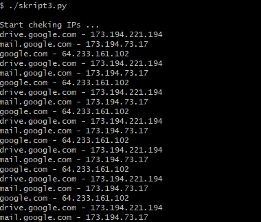
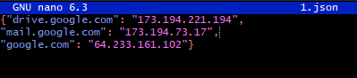
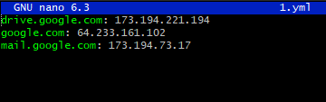

##   Домашнее задание к занятию "4.3. Языки разметки JSON и YAML" <br/>

## Обязательная задача 1
Мы выгрузили JSON, который получили через API запрос к нашему сервису:
```
    { "info" : "Sample JSON output from our service\t",
        "elements" :[
            { "name" : "first",
            "type" : "server",
            "ip" : 7175 
            }
            { "name" : "second",
            "type" : "proxy",
            "ip : 71.78.22.43
            }
        ]
    }
```
  Нужно найти и исправить все ошибки, которые допускает наш сервис <br/>

**Ответ:** <br/>

- **строка 6** - пропущена запятая внутри объекта 
- **строка 9** - отсутствует закрывающая кавычка у ключа ip
- **строка 2** - пропущен пробел между  `:[`  (открытие массива)
- **строка 5** - непонятная запись ip адреса, не дописан и без кавычек
<br/>


## Обязательная задача 2
В прошлый рабочий день мы создавали скрипт, позволяющий опрашивать веб-сервисы и получать их IP. К уже реализованному функционалу нам нужно добавить возможность записи JSON и YAML файлов, описывающих наши сервисы. Формат записи JSON по одному сервису: `{ "имя сервиса" : "его IP"}`. Формат записи YAML по одному сервису: `- имя сервиса: его IP`. Если в момент исполнения скрипта меняется IP у сервиса - он должен так же поменяться в yml и json файле.

### Ваш скрипт:
```python
#!/usr/bin/env python3

import socket
import time
import json
import yaml

srv_ip = {'drive.google.com':'', 'mail.google.com':'', 'google.com':''}
print("Start checking IPs ...")
while(1==1):
    for srv in srv_ip.keys():
        ip = socket.gethostbyname(srv)
        if(ip == srv_ip[srv]):
            print(f'{srv} - {ip}')
        elif(srv_ip[srv]==''):
            srv_ip[srv] = ip
        else:
            print(f'[ERROR] {srv} IP mismatch: {srv_ip[srv]} {ip}')
            srv_ip[srv] = ip
    with open("1.json", 'w') as json_file:
        json_file.write(json.dumps(srv_ip))
    with open("1.yml", 'w') as yaml_file:
        yaml_file.write(yaml.dump(srv_ip))
    time.sleep(10)
```

### Вывод скрипта при запуске при тестировании:




### Json-файл(ы), который(е) записал ваш скрипт:
```json
{"drive.google.com": "173.194.221.194",
"mail.google.com": "173.194.73.17",
"google.com": "64.233.161.102"}
```


### Yml-файл(ы), который(е) записал ваш скрипт:
```yaml
drive.google.com: 173.194.221.194
google.com: 64.233.161.102
mail.google.com: 173.194.73.17
```


<br/>