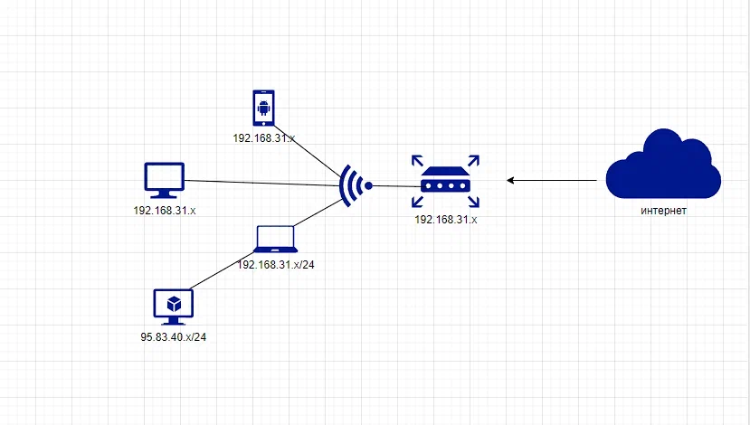

###                Домашнее задание по лекции "Компьютерные сети (лекция 3) <br/><br/><br/>


**1.** Подключитесь к публичному маршрутизатору в интернет. Найдите маршрут к вашему публичному IP <br/>

`route-views>show ip route 95.73.40.183/32` <br/>
                                      ^
`% Invalid input detected at '^' marker.` <br/>

```shell
route-views>show ip route 95.73.40.183
Routing entry for 95.73.40.0/21
  Known via "bgp 6447", distance 20, metric 0
  Tag 2497, type external
  Last update from 202.232.0.2 7w0d ago
  Routing Descriptor Blocks:
  * 202.232.0.2, from 202.232.0.2, 7w0d ago
      Route metric is 0, traffic share count is 1
      AS Hops 2
      Route tag 2497
      MPLS label: none
```
[show_ip_route](https://disk.yandex.ru/i/F_IYPyl4d-V-BQ) <br/>

**2.** Создайте `dummy0` интерфейс в Ubuntu. Добавьте несколько статических маршрутов. Проверьте таблицу маршрутизации. <br/>

- Создал `dummy0` интерфейс: <br/>

```shell
vagrant@vagrant:~$ sudo ip link add dummy0 type dummy
vagrant@vagrant:~$ ip -c -br link
lo               UNKNOWN        00:00:00:00:00:00 <LOOPBACK,UP,LOWER_UP>
eth0             UP             08:00:27:b1:28:5d <BROADCAST,MULTICAST,UP,LOWER_UP>
dummy0           DOWN           8e:e5:e1:6d:c8:49 <BROADCAST,NOARP>
```
<br/>

- Проверил таблицу маршрутизации: <br/>

```shell
vagrant@vagrant:~$ ip route show
default via 10.0.2.2 dev eth0 proto dhcp src 10.0.2.15 metric 100
10.0.2.0/24 dev eth0 proto kernel scope link src 10.0.2.15
10.0.2.2 dev eth0 proto dhcp scope link src 10.0.2.15 metric 100
```
<br/>

- Добавил статические маршруты: <br/>

```shell
vagrant@vagrant:~$ ip route show
default via 10.0.2.2 dev eth0 proto dhcp src 10.0.2.15 metric 100
10.0.2.0/24 dev eth0 proto kernel scope link src 10.0.2.15
10.0.2.2 dev eth0 proto dhcp scope link src 10.0.2.15 metric 100
95.73.40.183 dev eth0 scope link
192.168.23.0/24 via 10.0.2.15 dev eth0
````
<br/><br/>

**3.** Проверьте открытые TCP порты в Ubuntu, какие протоколы и приложения используют эти порты?<br/> Приведите несколько примеров. <br/>
```shell
vagrant@vagrant:~$ ss -tlp (t -tcp; l -listen (в ожидании входящего трафика); p - процесс)
State   Recv-Q  Send-Q     Local Address:Port       Peer Address:Port  Process
LISTEN  0       4096       127.0.0.53%lo:domain          0.0.0.0:*
LISTEN  0       128              0.0.0.0:ssh             0.0.0.0:*
LISTEN  0       128                 [::]:ssh                [::]:*

vagrant@vagrant:~$ ss -tlpn 
State    Recv-Q   Send-Q     Local Address:Port     Peer Address:Port  Process
LISTEN   0        4096       127.0.0.53%lo:53            0.0.0.0:*
LISTEN   0        128              0.0.0.0:22            0.0.0.0:*
LISTEN   0        128                 [::]:22               [::]:*


vagrant@vagrant:~$ ss -t -a (t - tcp; a - соединения ожидающие подключений)
State     Recv-Q     Send-Q         Local Address:Port           Peer Address:Port     Process
LISTEN    0          4096           127.0.0.53%lo:domain              0.0.0.0:*
LISTEN    0          128                  0.0.0.0:ssh                 0.0.0.0:*
ESTAB     0          0                  10.0.2.15:ssh                10.0.2.2:50153
LISTEN    0          128                     [::]:ssh                    [::]:*


vagrant@vagrant:~$ ss -lntup (tcp и udp соединения одновременно)
Netid    State     Recv-Q    Send-Q        Local Address:Port       Peer Address:Port   Process
udp      UNCONN    0         0             127.0.0.53%lo:53              0.0.0.0:*
udp      UNCONN    0         0            10.0.2.15%eth0:68              0.0.0.0:*
tcp      LISTEN    0         4096          127.0.0.53%lo:53              0.0.0.0:*
tcp      LISTEN    0         128                 0.0.0.0:22              0.0.0.0:*
tcp      LISTEN    0         128                    [::]:22                 [::]:*
```
<br/>

**4.** Проверьте используемые UDP сокеты в Ubuntu, какие протоколы и приложения используют эти порты? <br/>
```shell
 vagrant@vagrant:~$ ss -ulpn
State      Recv-Q     Send-Q          Local Address:Port         Peer Address:Port    Process
UNCONN     0          0               127.0.0.53%lo:53                0.0.0.0:*
UNCONN     0          0              10.0.2.15%eth0:68                0.0.0.0:*

53 - DNS-сервер (общий доступ к подключению интернета)
68 - Bootstrap Protocol Client (клиент протокола начальной загрузки)
```
<br/>

**5.** Используя diagrams.net, создайте L3 диаграмму вашей домашней сети или любой другой сети, с которой вы работали. <br/>



<br/><br/><br/>


###                Домашнее задание по лекции "Компьютерные сети (лекция 2)"  <br/><br/><br/>


**1.** Проверьте список доступных сетевых интерфейсов на вашем компьютере. Какие команды есть для этого в Linux и в Windows? <br/>

- **Windows** <br/> 
`ipconfig` <br/>


- **Linux** <br/> 
`ip -c -br link` <br/>
`ip a` <br/><br/>

**2.** Какой протокол используется для распознавания соседа по сетевому интерфейсу?<br/> Какой пакет и команды есть в Linux для этого?<br/>

`LLDP` – протокол для обмена информацией между соседними устройствами, позволяет определить к какому порту коммутатора подключен сервер.<br/>

- Пакет `lldpd` <br/>
- Команда `lldpctl` <br/><br/>

**3.** Какая технология используется для разделения L2 коммутатора на несколько виртуальных сетей?<br/> Какой пакет и команды есть в Linux для этого? Приведите пример конфига.<br/>

- техналогия `valn` <br/>
- утилита `vconfig` <br/> 
`ip -br link`  - проверка сетевых интерфейсов <br/>
`sudo vconfig add eth0 10` - Создал `vlan10` на интерфейсе `eth0` <br/><br/>
```shell
vagrant@vagrant:~$ ip -br link
lo               UNKNOWN        00:00:00:00:00:00 <LOOPBACK,UP,LOWER_UP>
eth0             UP             08:00:27:b1:28:5d <BROADCAST,MULTICAST,UP,LOWER_UP>
vagrant@vagrant:~$ sudo vconfig add eth0 5

Warning: vconfig is deprecated and might be removed in the future, please migrate to ip(route2) as soon as possible!

vagrant@vagrant:~$ ip -br link
lo               UNKNOWN        00:00:00:00:00:00 <LOOPBACK,UP,LOWER_UP>
eth0             UP             08:00:27:b1:28:5d <BROADCAST,MULTICAST,UP,LOWER_UP>
eth0.5@eth0      DOWN           08:00:27:b1:28:5d <BROADCAST,MULTICAST>
````
<br/><br/>

**4.** Какие типы агрегации интерфейсов есть в Linux? Какие опции есть для балансировки нагрузки? Приведите пример конфига.<br/>

драйвер `bonding` агрегация сетевых интерфейсов в Linux <br/>

- **Опции:** <br/>

`balance-rr` - поочерёдное испольщзование интерфейсов про отправке пакетов  <br/>
`active-backup` - Работает только один интерфейс, второй находится в резерве <br/>
`balance-xor` - Интерфейс определяет, через интерфейс отправить пакеты, в зависимости от MAC-адресов источника и получателя.<br/>
`broadcast` - Все пакеты отправляются через каждый интерфейс. <br/>
`802.3ad` - Реализует стандарты объединения каналов IEEE и обеспечивает как увеличение пропускной способности, так и отказоустойчивость. <br/>
`balance-tlb` - Распределение нагрузки при передаче. Входящий трафик обрабатывается в обычном режиме, а при передаче интерфейс определяется на основе данных о загруженности. <br/>
`balance-alb` - Адаптивное распределение нагрузки. Аналогично предыдущему режиму, но с возможностью балансировать также входящую нагрузку. <br/>
<br/>
`Конфиг на примере Ubuntu 20.04.3 LTS через netplan`
```shell
sudo nano /etc/netplan/01-netcfg.yaml отредактировал файл
sudo netplan apply - перезапустил netpaln
```
[bonding](https://disk.yandex.ru/i/U-8PUJ4b7OKHvQ) <br/><br/>


**5.** Сколько IP адресов в сети с маской /29 ? Сколько /29 подсетей можно получить из сети с маской /24. Приведите несколько примеров /29 подсетей внутри сети 10.10.10.0/24.<br/>

`ipcalc 192.168.1.1/29` <br/>
`Hosts/Net: 6` <br/>
`Subnets:   32 (получили 32 подсети с маской /29 из сети с маской /24 )` <br/>
[ipcalc](https://disk.yandex.ru/i/aTOsYHhbTscAng) <br/><br/>


**6.** Задача: вас попросили организовать стык между 2-мя организациями. Диапазоны 10.0.0.0/8, 172.16.0.0/12, 192.168.0.0/16 уже заняты.  <br/> Из какой подсети допустимо взять частные IP адреса? Маску выберите из расчета максимум 40-50 хостов внутри подсети. <br/>

Использовать частную подсеть `100.64.0.0` <br/>
`255.255.255.192 = 26 хосты 62` <br/>
`100.64.0.0/26` <br/>
[29/24](https://disk.yandex.ru/i/bqwKQd11TO4xtw) <br/>
[10.64.0.0/26](https://disk.yandex.ru/i/FPWo2RgJI9fX4g) <br/><br/>


**7.** Как проверить ARP таблицу в Linux, Windows? Как очистить ARP кеш полностью? <br/> Как из ARP таблицы удалить только один нужный IP?<br/>

- **Linux** <br/>

`arp -a` (устаревшая команда) <br/>
`ip neigh` (новая команда) <br/>
`sudo arp -d ip address` (удалить один хост из ARP) <br/>

- **Windows** <br/>

`arp -a` Проверить ARP таблицу <br/>
`arp -d` Очистить ARP таблицу <br/>
`arp -d ip address` (удалить один хост из ARP) <br/><br/><br/><br/>


###              Домашнее задание по лекции "Компьютерные сети (лекция 1)"   <br/><br/><br/>


**1.** Работа c HTTP через телнет. <br/>
- Подключитесь утилитой телнет к сайту stackoverflow.com `telnet stackoverflow.com 80`   <br/>
- отправьте HTTP запрос  <br/>
```shell
GET /questions HTTP/1.0 <br/>
HOST: stackoverflow.com <br/>
[press enter]
[press enter]
```
- В ответе укажите полученный HTTP код, что он означает? <br/><br/>


`Получили код 301. Постоянный редирект протокола http на https с таким же url` <br/>
[1.telnet](https://disk.yandex.ru/i/DK-4r7Z8rg0w9A)  <br/><br/>


**2.** Повторите задание 1 в браузере, используя консоль разработчика F12. <br/>
- откройте вкладку `Network` <br/>
- отправьте запрос http://stackoverflow.com <br/>
- найдите первый ответ HTTP сервера, откройте вкладку `Headers` <br/>
- укажите в ответе полученный HTTP код. <br/>
- проверьте время загрузки страницы, какой запрос обрабатывался дольше всего? <br/>
- приложите скриншот консоли браузера в ответ. <br/><br/>

`В ответ получили код 307 Temporary Redirect` <br/>
[307](https://disk.yandex.ru/i/DK-4r7Z8rg0w9A) <br/>
`Обработка дольше всего была у стартовой страницы сайта, время отклика 163мс` <br/>
[163мс](https://disk.yandex.ru/i/g6KFQJAgBTSAxg) <br/>


**3.** Какой IP адрес у вас в интернете? <br/>
```shell
vagrant@vagrant:~$ dig +short myip.opendns.com @resolver1.opendns.com 
77.51.152.xx
```
<br/>

**4.** Какому провайдеру принадлежит ваш IP адрес? Какой автономной системе AS? Воспользуйтесь утилитой `whois`  <br/>
```shell
vagrant@vagrant:~$ whois 77.51.152.xxx | grep ^descr
descr:          OJSC Rostelecom, Moscow Region Branch
descr:          DSL access network in  Moscow region
descr:          Rostelecom networks
```
[whois](https://disk.yandex.ru/i/28AXS94WLB_2Dw) 
```shell
vagrant@vagrant:~$ whois 77.51.152.xxx | grep ^origin
origin:         AS12389
```
`ip - OJSC Rostelecom` <br/>
`AS - AS12389`  <br/><br/>


**5.** Через какие сети проходит пакет, отправленный с вашего компьютера на адрес 8.8.8.8? Через какие AS? <br/> Воспользуйтесь утилитой `traceroute` <br/> 

`$ traceroute -An 8.8.8.8` <br/>
`$ mtr -zn 8.8.8.8` <br/> 
`Пакет проходит через AS 15169 12389 25515` <br/> [mtr](https://disk.yandex.ru/i/x2mYJorHNTDBrQ) <br/> [traceroute](https://disk.yandex.ru/i/WI7YMujyfu1XQw)

```shell
 vagrant@vagrant:~$ grep org-name <(whois AS12389)
org-name:       PJSC Rostelecom
vagrant@vagrant:~$ grep org-name <(whois AS25515)
org-name:       PJSC Rostelecom
vagrant@vagrant:~$ grep OrgName <(whois AS15169)
OrgName:        Google LLC
```
 <br/>


**6.** Повторите задание 5 в утилите `mtr`. На каком участке наибольшая задержка - delay? <br/>

`Задержка на хосте 9` <br/>
[mtr6](https://disk.yandex.ru/i/d-3XPL-A0Hg_1w) <br/>


**7.** Какие DNS сервера отвечают за доменное имя dns.google? Какие A записи? Воспользуйтесь утилитой `dig` <br/>

`NS` <br/> 
```shell
vagrant@vagrant:~$ dig +short NS dns.google
ns4.zdns.google.
ns2.zdns.google.
ns3.zdns.google.
ns1.zdns.google.
```
`А` <br/>
```shell
vagrant@vagrant:~$ dig +short A dns.google
8.8.4.4
8.8.8.8
```
<br/>

**8.** Проверьте PTR записи для IP адресов из задания 7. Какое доменное имя привязано к IP? Воспользуйтесь утилитой `dig` <br/>
```shell
vagrant@vagrant:~$ for ip in `dig +short A dns.google`; do dig -x $ip | grep ^[0-9].*in-addr; done
8.8.8.8.in-addr.arpa.   300     IN      PTR     dns.google.
4.4.8.8.in-addr.arpa.   300     IN      PTR     dns.google.
```
<br/><br/>